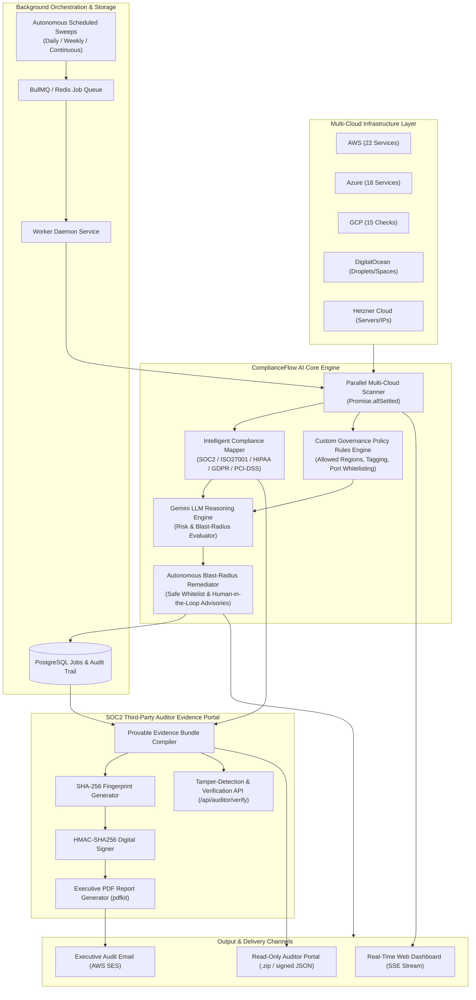

# ComplianceFlow AI

> **Service as Software** — An AI-Native Service (AINS) platform that delivers autonomous compliance outcomes, continuous multi-cloud governance, and cryptographically verified SOC2 audit packages.

ComplianceFlow demonstrates the "Service-as-Software" thesis popularized by Gustaf Alströmer. Traditional compliance software (SaaS) provides tools to help you do the work. **ComplianceFlow AI** uses autonomous agents to **do the work for you**, delivering a completed, provable audit outcome.

---

## 🏛️ System Architecture



---

## 🦾 Core Thesis: The AINS Model

ComplianceFlow passes the **Structural Test**: If you remove the AI intelligence layer, the business would collapse or become economically unviable due to human labor costs.

| Traditional SaaS (SOC2) | ComplianceFlow AI (AINS) |
|---|---|
| Sells access to a dashboard | Sells a completed Audit Report |
| Charges per seat | Charges per Outcome |
| Identifies what's broken | Remediates resources automatically |
| Requires human "Evidence Collectors" | Autonomous agents capture, hash, and digitally sign evidence |

---

## ✨ Features & Capabilities

### 1. High-Performance Multi-Cloud Governance (200+ Controls)
- **Concurrent ARM / AWS / GCP / DO / Hetzner Interrogation**: Parallelized with `Promise.allSettled()` — full enterprise scanning completes in **~2 to 8 seconds**.
- **AWS**: S3, EC2, RDS, IAM, KMS, CloudTrail, GuardDuty, Macie, Lambda, WAF, Shield Advanced, DynamoDB, API Gateway, CloudFront, SQS, SNS, ELB, CloudWatch, Config.
- **Azure**: VMs, OS Disks, App Services, NSGs, Subnets, Storage Accounts, Soft Delete, Cosmos DB, AKS Clusters, ACR, Key Vaults, SQL Servers, PostgreSQL, Recovery Vaults, Defender for Cloud.
- **GCP**: GCS Buckets (UBLA), CloudSQL (SSL/Public IPs), BigQuery datasets, GKE clusters, VPC Service Controls, Service Account Keys.
- **DigitalOcean & Hetzner**: Droplet/Server backups, Spaces ACLs, Firewalls, Primary IP auto-delete, Rescue Mode detection.

### 2. Custom Governance Policy Rules Engine (`core/policy_engine.js`)
- Enforces organization-specific policies alongside standard regulatory frameworks:
  - **Restricted Geographic Regions (`POLICY_UNAUTHORIZED_REGION`)**: Flags assets provisioned outside approved jurisdictions (e.g. EU or US compliance zones).
  - **Mandatory Resource Tagging (`POLICY_MISSING_TAGS`)**: Enforces required tags (`Environment`, `Owner`, `DataClassification`).
  - **Inbound Port Whitelisting (`POLICY_DISALLOWED_PORT`)**: Flags public ingress rules allowing unauthorized ports.
  - **Automated Backup & Snapshot Guardrails (`POLICY_MANDATORY_BACKUPS`)**: Flags compute, storage, and database assets lacking automated backups.

### 3. SOC2 Third-Party Auditor Evidence Portal (`core/auditor_portal.js`)
- **Time-Limited Auditor Access Tokens**: Read-only cryptographically signed tokens for external CPA auditors (Schellman, Prescient, A-LIGN, Coalfire).
- **Provable Evidence Bundles**:
  - `evidence_manifest.json`: Every asset and finding with immutable SHA-256 evidence fingerprints.
  - `control_proof_soc2.json`, `control_proof_iso27001.json`, `control_proof_hipaa.json`, `control_proof_pci_dss.json`: Per-framework control evidence mapping.
  - `executive_summary.pdf`: Embedded executive PDF audit report.
  - `digital_signature.sig`: Cryptographic HMAC-SHA256 signature for tamper verification.
  - `audit_trail.log`: Chronological event trail.
- **Tamper-Detection API**: `/api/auditor/verify` asserts signature validity and checksum matching.

### 4. Autonomous Scheduled Sweeps Engine (`scheduler.js`)
- Configurable recurring sweeps (`daily`, `weekly`, `continuous`).
- Automatic job queuing via BullMQ and progress tracking in PostgreSQL.
- Automated generation of executive PDF and HTML reports delivered via AWS SES.

---

## 🧪 Testing & Audit Trail Verification

ComplianceFlow includes a comprehensive automated test and audit recording suite.

### Run All Unit and End-to-End Tests
```bash
npm test
```

### Record All Test Runs with Timestamps
To execute the complete test harness (Vitest, Auditor Portal, Scheduled Sweeps, Multi-Cloud E2E) and record timestamped logs:
```bash
npm run test:record
```

Recorded test logs and audit reports are preserved in:
- `tests/results/latest_test_run.md`
- `tests/results/test_execution_history.json`
- `tests/results/auditor_portal_runs.log`

---

## 🗺️ Product Roadmap

### ✅ Completed: Phase 1 — Foundation
- [x] Landing page design system.
- [x] Autopilot terminal simulation.
- [x] Outcome-based pricing model UI.

### ✅ Completed: Phase 2 — Autonomous Core
- [x] Dashboard application architecture.
- [x] Cloud connection flow simulation.
- [x] Resource inventory & multi-level scanner.
- [x] Remediation engine with config diffs.

### ✅ Completed: Phase 3 — Audit & Evidence
- [x] Evidence Vault with cryptographic hashing.
- [x] Trust Service Criteria (TSC) mapping logic.
- [x] Dynamic Report Generator & PDF Export.

### ✅ Completed: Phase 4 — Multi-Framework & Parity
- [x] GDPR, HIPAA, ISO 27001, and PCI-DSS mapping.
- [x] Multi-Cloud Governance Parity (AWS, Azure, GCP, DigitalOcean, Hetzner).
- [x] High-performance parallel scanning (`Promise.allSettled`).

### ✅ Completed: Phase 5 — Autonomous Operations & Auditor Portal
- [x] **SOC2 Third-Party Auditor Evidence Portal** with HMAC-SHA256 digital signatures.
- [x] **Custom Governance Policy Rules Engine** (Regions, Tags, Port Whitelisting, Backups).
- [x] **Autonomous Scheduled Sweeps Engine** with automated PDF/HTML delivery.
- [x] **Unified Test & Audit Recording Pipeline** (`npm run test:record`).

### 🚀 Upcoming: The Path to v2.5
- **Phase 6: AI Questionnaire Automation**: Autocomplete security questionnaires (SIG/CAIQ) directly from signed evidence bundles.
- **Phase 7: Real-Time Slack & Teams Webhooks**: Direct interactive alert cards for critical compliance drift.

---

## 📁 Project Structure

```text
compliance-flow/
├── api/                        # Express / Serverless API Handlers
│   ├── auditor.js              # Auditor token issuance, export & verify
│   ├── scan.js                 # Multi-cloud scanning endpoint
│   ├── tenants.js              # Tenant management & settings
│   └── validate.js             # Cloud connection validator
├── core/                       # Core ComplianceFlow Governance Engine
│   ├── auditor_portal.js       # Provable evidence bundle compiler & signer
│   ├── policy_engine.js        # Custom governance policy rules engine
│   ├── scanner.js              # Multi-cloud scanner router & policy evaluator
│   ├── remediator.js           # Multi-cloud auto-remediator router
│   ├── reporter.js             # Executive PDF (pdfkit) & HTML report generator
│   ├── gemini.js               # AI Reasoning & blast-radius engine
│   ├── compliance_mapper.js    # SOC2/ISO/HIPAA/GDPR cross-walk engine
│   ├── controls.js             # Comprehensive multi-framework control matrix
│   ├── db.js                   # PostgreSQL connection & memory fallback pool
│   ├── queue.js                # BullMQ Redis job queue
│   └── providers/              # Deep provider implementations
│       ├── azure.js            # Parallel Azure ARM scanner (18 services)
│       ├── aws.js              # Parallel AWS scanner (22 services)
│       ├── gcp.js              # GCP scanner (15 checks)
│       ├── digitalocean.js     # DigitalOcean scanner
│       └── hetzner.js          # Hetzner Cloud scanner
├── scheduler.js                # Autonomous recurring sweep handler
├── worker.js                   # Background job worker processor
├── server.js                   # Main Express API server
├── app.html                    # Real-time compliance dashboard
├── evidence.js                 # Frontend evidence vault & auditor exporter
├── scripts/
│   └── record_all_tests.js     # Unified test recorder & timestamped logger
├── tests/
│   ├── unit/                   # Unit test suites (8 test files)
│   ├── e2e/                    # Multi-cloud End-to-End lifecycle tests
│   └── results/                # Recorded test runs, history & auditor logs
└── package.json                # Dependencies & scripts
```

---

## 📄 License
MIT © 2026 udene1
